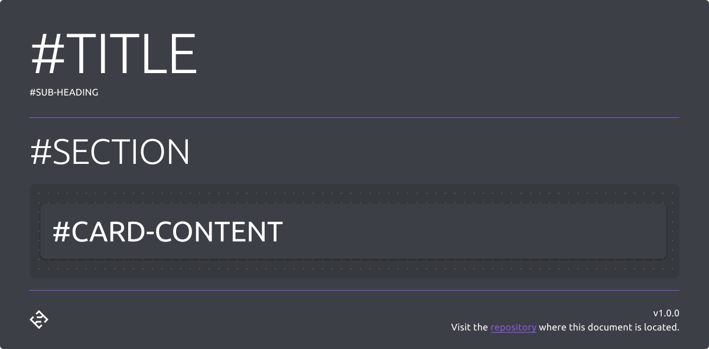

# Guide Document

This template is saved as `.fig` format, which is native to [Figma](https://www.figma.com/), a browser-based UI and UX design application.

## Showcase

## Usage

The guide document template is used to create guide style documents which have a consistent appearance, stucture and quality. Primarily found in [smiosoft/development-guide](https://github.com/smiosoft/development-guide).

### Editing

#### Content

Use the `content` layer to display the guide content, and ensure to seperate with `section` layers as appropriate.

Any visual material, especially anything that is intended to be exported and displayed in external documents (e.g README.md) needs to be positioned in a card. This card has a solid fill colour, and is positioned on a semi-transparent background - this is inteded to support being displayed on any page, with any colour/theme.

#### Local Styles

Ensure to utulise the local styles as much as possible, as these reflect our [style guide](https://github.com/smiosoft/development-guide/tree/master/src/style-guide).

#### Document location link

Ensure to update the "repository" link in the `footer` to the location where the document is/will be located.

### Exporting

There is an expectation of any visual material that is inteded to be exported to be placed in a card - select the layer that holds the card, then use the `Export` section at the bottom, with `PNG` format selected to carry out the export.