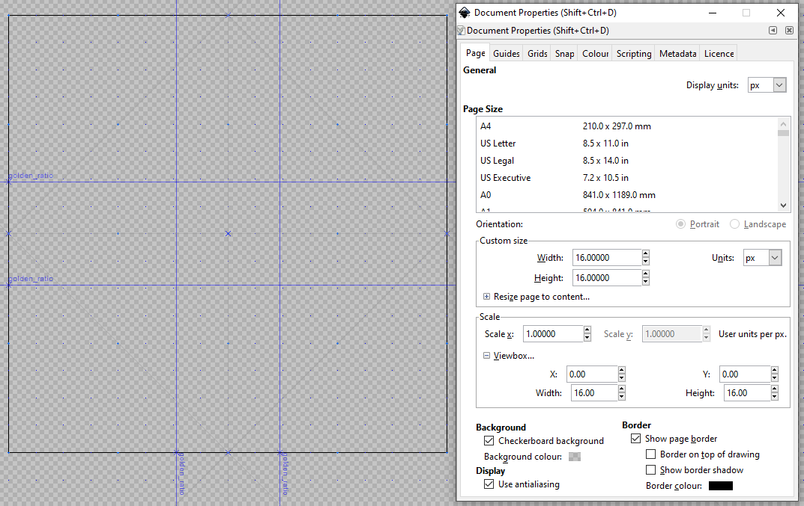

# Icon Template

This template is saved as `.svg` format, and includes metadata for [Inkscape](https://inkscape.org/) vector graphics editing software.

## Showcase

## Usage

### Editing

- Update the `id` attribute for appropriate layers/nodes

### Exporting

Ensure to export as `Plain SVG`, without any of the editor metadata. Additionally, use [svgomg](https://jakearchibald.github.io/svgomg/) to optimise the icon.
