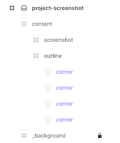
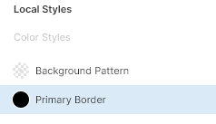
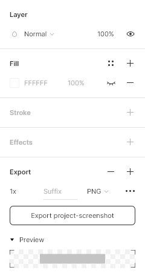

# Project Screenshot Template

This template is saved as `.fig` format, which is native to [Figma](https://www.figma.com/), a browser-based UI and UX design application.

## Showcase

## Usage

The project screenshot image (`1760px x >260px`) can be found referenced in a repository `README`, alongside a matching [project-title](../project-title). The height of this image will scale to the screenshot content.

### Pages

### Layers

### Editing

#### Screenshot

Use the `screenshot` frame layer as a guide to position an image, and center the image to the frame layer. Resize the height of the `project-screenshot` root frame layer to accommodate the image.

#### Local Styles

Update the `Primary Border` local style to the primary/dominant colour from the project icon. This will update the stroke colour of the `corner` component.

### Exporting

Select the `project-screenshot` root frame layer, and ensure that the `Fill` property is hidden. Use the `Export` section at the bottom, with `PNG` format selected.

