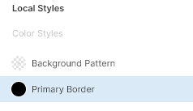
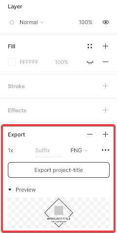

# Project Title Template

This template is saved as `.fig` format, which is native to [Figma](https://www.figma.com/), a browser-based UI and UX design application.

## Showcase

## Usage

The project title image (`1760x520`) can be found referenced at the top of a repository `README`.

### Layers

### Editing

#### Icon

Use the `project-icon` frame layer as a guide to position a project icon (`152x152`). Ensure to remove/hide the `Fill` property afterwards.

#### Local Styles

Update the `Primary Border` local style to the primary/dominant colour from the project logo. This will update the stroke colour of the `diamond` shape layer.

### Exporting

Select the `project-title` root frame layer and ensure that the `Fill` property is hidden. Use the `Export` section at the bottom, with `PNG` format selected.

