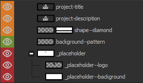

# Project Title Template

This template is saved as `.fig` format, which is native to [Figma](https://www.figma.com/), a browser-based UI and UX design application.

## Showcase

## Usage

### Layers

- `green` - no action required
- `orange` - action required
- `red` - do not include these layers when exporting

### Editing

- Use the `_placeholder--logo` layer as a guide to insert a project logo (`150px by 150px`)
- Use the colour picker tool to pick out the primary/dominant colour from the project logo and fill `shape--diamond`
- Update the text for `project-title` and `project-description` as appropriate

### Exporting

Ensure all the `red` layers are hidden and export as `.png` with transparency.
